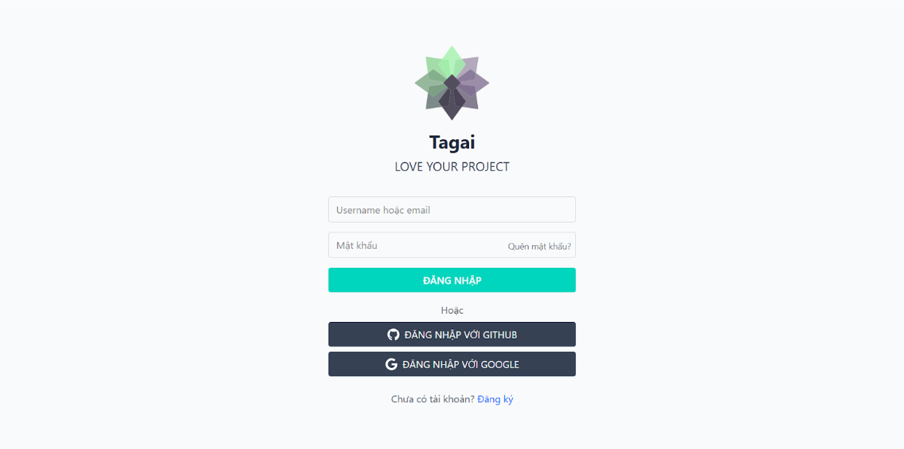
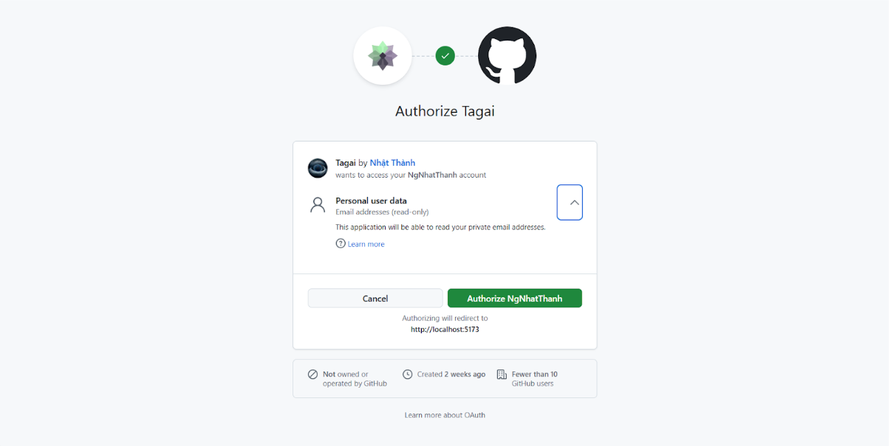
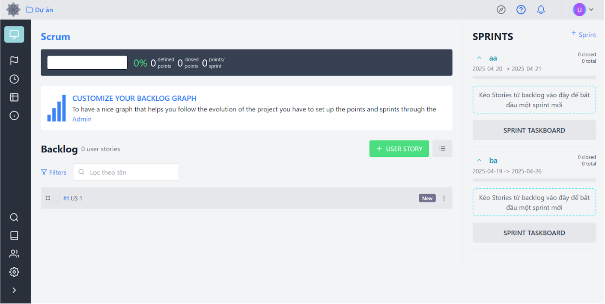
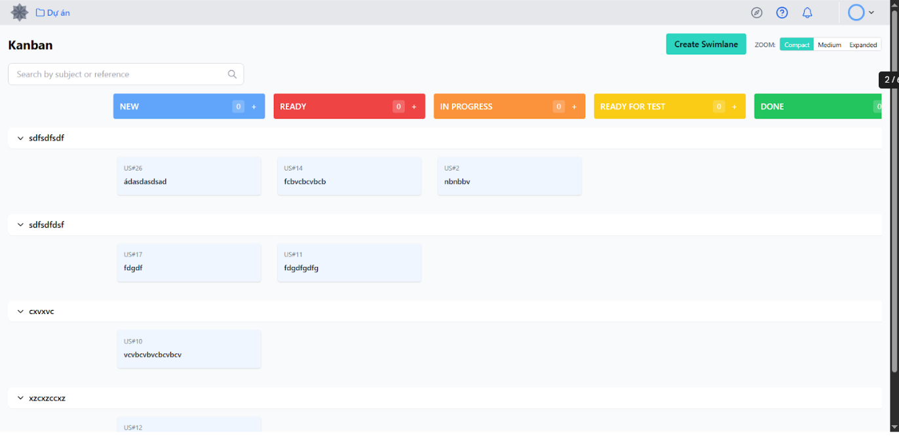
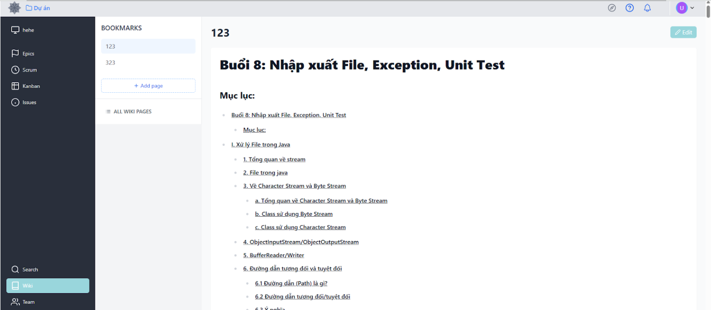
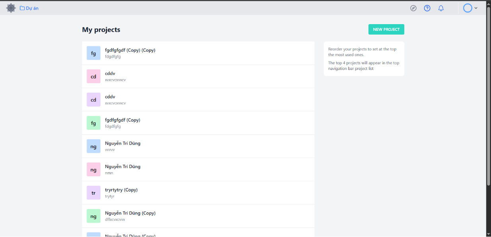
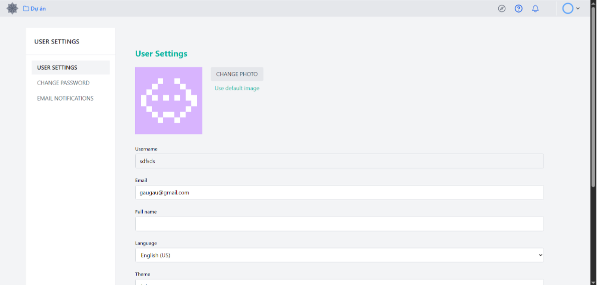
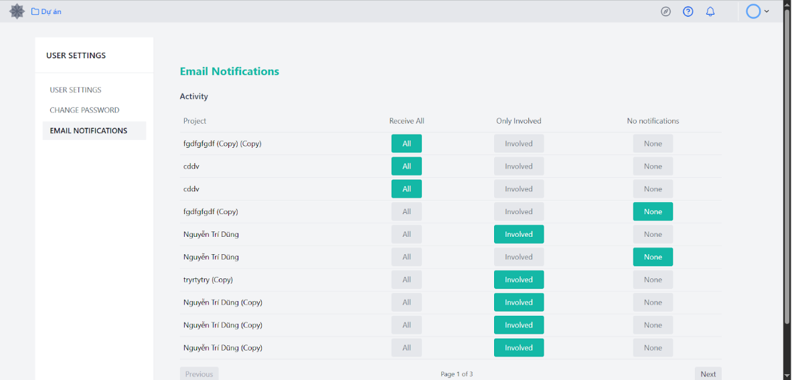

# 🚀 TAGAI - Advanced Project Management Platform

<div align="center">


**Empowering Software Development Teams with Intelligent Project Management**

[](https://opensource.org/licenses/MIT)
[](https://www.oracle.com/java/)
[](https://spring.io/projects/spring-boot)
[](https://reactjs.org/)
[](https://www.docker.com/)

</div>

## 🌟 Overview

In the rapidly evolving world of software development, effective team collaboration remains one of the biggest challenges. From communication transparency to progress tracking, from task duplication to missed deadlines - these issues become even more critical as teams scale or work remotely.

**Tagai** emerges as a specialized project management platform, meticulously designed for software development teams. More than just a task tracker, Tagai envisions itself as a "digital assistant" that optimizes workflows, reduces response times, and amplifies productivity. Our mission is to seamlessly integrate people, processes, and technology into a unified ecosystem.

### 🎯 Core Philosophy
- **Agile-First**: Built with Scrum and Kanban methodologies at its core
- **Developer-Centric**: Tailored specifically for software development workflows  
- **Real-Time Collaboration**: Instant updates and notifications keep everyone synchronized
- **Scalable Architecture**: Grows with your team and project complexity

## ✨ Key Features

### 📋 **Project Management**
- 🏗️ **Multi-Project Dashboard** - Centralized view of all your projects
- 👥 **Team Collaboration** - Role-based access control and permissions
- 📊 **Progress Analytics** - Real-time insights and reporting

### 🏃‍♂️ **Agile Methodology Support**
- 🎯 **Sprint Management** - Complete sprint lifecycle management
- 📝 **Backlog Management** - Prioritize and organize user stories
- 🔄 **Drag & Drop Kanban** - Intuitive visual workflow management
- 📈 **Burndown Charts** - Track sprint progress and velocity

### 🛠️ **Advanced Task Management**
- ✅ **User Stories & Tasks** - Hierarchical work breakdown
- 🏷️ **Smart Tagging** - Categorize and filter work items
- ⏰ **Deadline Tracking** - Automated reminders and notifications
- 📎 **File Attachments** - Cloud-based file storage with Cloudinary

### 🔍 **Intelligent Features**
- 🔎 **Global Search** - Find anything across projects instantly
- 📚 **Wiki System** - Collaborative documentation with Markdown support
- 🔔 **Real-Time Notifications** - Stay updated with WebSocket integration
- 🔐 **OAuth2 Integration** - Secure login with Google and GitHub

## 👥 Team

<table>
<tr>
<td align="center">
<a href="https://github.com/NguyenBui256">

<br />
<sub><b>Bùi Thế Vĩnh Nguyên</b></sub>
</a>
<br />
<sub>Full-Stack Developer</sub>
</td>
<td align="center">
<a href="https://github.com/dungnguyen2112">

<br />
<sub><b>Nguyễn Trí Dũng</b></sub>
</a>
<br />
<sub>Backend Developer</sub>
</td>
<td align="center">
<a href="https://github.com/NgNhatThanh">

<br />
<sub><b>Nguyễn Nhật Thành</b></sub>
</a>
<br />
<sub>Frontend Developer</sub>
</td>
</tr>
</table>

## 🖼️ Screenshots

<div align="center">

### 📊 Project Dashboard


### 🎯 Kanban Board


### 📋 Sprint Management


### 📝 Task Details


### 📚 Wiki System


### 👥 Team Management


### ⚙️ Project Settings


### 🔍 Search Functionality


### 🗄️ Database Architecture


</div>

## 🗄️ Database Design

Our database architecture is carefully designed to support complex project management workflows with optimal performance and scalability.

### Key Design Principles:
- **Normalized Structure**: Eliminates data redundancy and ensures consistency
- **Relationship Integrity**: Foreign key constraints maintain data relationships
- **Scalable Schema**: Designed to handle growing data volumes
- **Performance Optimized**: Strategic indexing for fast query execution

### Core Entities:
- **Users & Authentication**: Secure user management with role-based access
- **Projects & Teams**: Multi-project support with team collaboration
- **Agile Workflow**: Sprint, User Stories, Tasks with hierarchical structure
- **Communication**: Comments, notifications, and activity tracking
- **Documentation**: Wiki pages with file attachments
- **Configuration**: Customizable project settings and permissions


## 🛠️ Technology Stack

### 🖥️ Backend
- **Framework**: Spring Boot 3.x
- **Security**: Spring Security with JWT & OAuth2
- **Database**: MySQL 8.0 with JPA/Hibernate
- **Caching**: Redis for session management
- **Real-time**: WebSocket for live updates
- **Cloud Storage**: Cloudinary for file management
- **Build Tool**: Maven

### 🎨 Frontend
- **Framework**: React 19 with Hooks
- **Styling**: Tailwind CSS for modern UI
- **State Management**: React Context & Custom Hooks
- **Drag & Drop**: React Beautiful DnD
- **HTTP Client**: Axios with interceptors
- **Routing**: React Router v6
- **Build Tool**: Vite for fast development

### 🚀 DevOps & Deployment
- **Containerization**: Docker & Docker Compose
- **Web Server**: Nginx for production serving
- **Development**: Hot reload and live development servers

## 🚀 Quick Start

### Prerequisites
- Java 17+
- Node.js 18+
- MySQL 8.0+
- Redis
- Docker (optional but recommended)

### 🐳 Docker Setup (Recommended)

```bash
# Clone the repository
git clone https://github.com/NguyenBui256/tagai.git
cd tagai

# Start all services with Docker Compose
docker-compose up -d

# Access the application
# Frontend: http://localhost:5173
# Backend API: http://localhost:8080
```

### 🔧 Manual Setup

#### Backend Setup
```bash
cd ttcs
./mvnw clean install
./mvnw spring-boot:run
```

#### Frontend Setup
```bash
cd frontend
npm install
npm run dev
```

## 📁 Project Structure

```
tagai/
├── 📁 ttcs/                    # Spring Boot Backend
│   ├── 📁 src/main/java/       # Java source code
│   ├── 📁 src/main/resources/  # Configuration files
│   └── 📄 pom.xml              # Maven dependencies
├── 📁 frontend/                # React Frontend
│   ├── 📁 src/                 # React source code
│   ├── 📁 public/              # Static assets
│   └── 📄 package.json         # NPM dependencies
├── 📁 db/                      # Database scripts
├── 📄 docker-compose.yml       # Docker configuration
└── 📄 README.md               # This file
```

## 🔧 Configuration

### Environment Variables
Create `.env` files for configuration:

#### Backend (.env)
```properties
DATABASE_URL=jdbc:mysql://localhost:3306/tagai
DATABASE_USERNAME=your_username
DATABASE_PASSWORD=your_password
REDIS_HOST=localhost
REDIS_PORT=6379
JWT_SECRET=your_jwt_secret
CLOUDINARY_URL=your_cloudinary_url
```

#### Frontend (.env)
```properties
VITE_API_URL=http://localhost:8080/api
VITE_BACKEND_URL=http://localhost:8080
```

## 🤝 Contributing

We welcome contributions! Please see our [Contributing Guidelines](CONTRIBUTING.md) for details.

1. Fork the repository
2. Create a feature branch (`git checkout -b feature/amazing-feature`)
3. Commit your changes (`git commit -m 'Add amazing feature'`)
4. Push to the branch (`git push origin feature/amazing-feature`)
5. Open a Pull Request

## 📝 License

This project is licensed under the MIT License - see the [LICENSE](LICENSE) file for details.

## 📞 Support

If you have any questions or need support, please:
- 📧 Create an issue on GitHub
- 💬 Join our discussions
- 📖 Check our documentation

---

<div align="center">

**Built with ❤️ by the Tagai Team**

[⭐ Star this repo](https://github.com/NguyenBui256/tagai) if you find it helpful!

</div>

